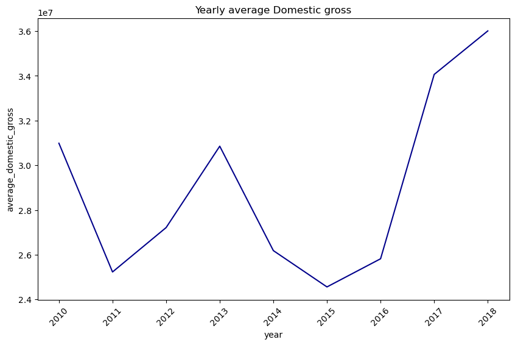

# Project Name - FILM TRENDS

# Defining the question

## Specific question 
The objective is to determine and analyse which type of films are currently trending and doing the best. We will predict this with the data we have and reviews.

# 1. Business Understanding
With the vast growth of original video content by leading entertainment platforms(like Netflix, Disney+, Prime), our company saw this as a huge opportunity to join the film industry. The goal is to launch a new movie studio capable of producing content that resonates with the current demand. 

Despite wanting to venture into this sector, our company still lack the industry-specific knowledge and experience in film production. To make informed investment decisions and reduce the risk of launching unsuccessful films, the company must understand which type of movies are currently performing best in the market. 

# 1.1 OBJECTIVES

## 1.1.1 Main objective
To determine which type of films are currently doing the best

## 1.1.2 Specific Objective
- To identify what genres are doing well
- Understand how factors like release date affect movie's performance
- Does runtime influence the rating
- Do specific directors, writers, and publishers correlate to revenue
- To check the average revenue over the years

# 1.2 Defining the Metric of Success
To come up with reccomendations That will best suit the businness objective

# Experimental Design
Below is the expected workflow:

* Data Cleaning and preparation
 * Loading our libraries and dataset
 * Dealing with missing values
 * Dealing with duplicates

* Performing EDA
 * Univariate Analysis
 * Bivariate Analysis
   

* Conclusion

* Recommendations

# Data Relevance
We are using data from three different entertainment platforms: IMDb, Box Office Mojo, and Rotten Tomatoes. We are going to check how these entertainment industries have performed and what factors affected the success of a particular movie. 

## Data Reading


```python
# import the necessary libraries
import pandas as pd
import seaborn as sns # for visualization
import matplotlib.pyplot as plt # for visualization
import sqlite3 # for sql queries
import numpy as np #for numeric calculations
import zipfile #reading zipfile
```


```python
# unzip the imdb database
zip_path = "zippeddata/im.db.zip"
with zipfile.ZipFile(zip_path, 'r') as zip_ref:
    zip_ref.extractall("unzipped_db")
```


```python
# connect to the extracted.db file
conn = sqlite3.connect("unzipped_db/im.db")
cur =conn.cursor()
```


```python
# load datasets from Box Office Mojo
movie_gross =pd.read_csv("zippeddata/bom.movie_gross.csv.gz")
```


```python
#load dataset from Rotten Tomatoes
rt_movie_info = pd.read_csv("zippeddata/rt.movie_info.tsv.gz",sep ='\t')
rt_reviews = pd.read_csv("zippeddata/rt.reviews.tsv.gz" ,sep='\t', encoding ='latin1')
```

# Data Exploration


```python
# Previewing the top of box office Mojo movie_gross
movie_gross.head()
```


<div>
<style scoped>
    .dataframe tbody tr th:only-of-type {
        vertical-align: middle;
    }

    .dataframe tbody tr th {
        vertical-align: top;
    }

    .dataframe thead th {
        text-align: right;
    }
</style>
<table border="1" class="dataframe">
  <thead>
    <tr style="text-align: right;">
      <th></th>
      <th>title</th>
      <th>studio</th>
      <th>domestic_gross</th>
      <th>foreign_gross</th>
      <th>year</th>
    </tr>
  </thead>
  <tbody>
    <tr>
      <th>0</th>
      <td>Toy Story 3</td>
      <td>BV</td>
      <td>415000000.0</td>
      <td>652000000</td>
      <td>2010</td>
    </tr>
    <tr>
      <th>1</th>
      <td>Alice in Wonderland (2010)</td>
      <td>BV</td>
      <td>334200000.0</td>
      <td>691300000</td>
      <td>2010</td>
    </tr>
    <tr>
      <th>2</th>
      <td>Harry Potter and the Deathly Hallows Part 1</td>
      <td>WB</td>
      <td>296000000.0</td>
      <td>664300000</td>
      <td>2010</td>
    </tr>
    <tr>
      <th>3</th>
      <td>Inception</td>
      <td>WB</td>
      <td>292600000.0</td>
      <td>535700000</td>
      <td>2010</td>
    </tr>
    <tr>
      <th>4</th>
      <td>Shrek Forever After</td>
      <td>P/DW</td>
      <td>238700000.0</td>
      <td>513900000</td>
      <td>2010</td>
    </tr>
  </tbody>
</table>
</div>


Our Target variable is the studio,year, foreign gross and domestic gross


```python
# preview the top of rt_movie_info
rt_movie_info.head()
```


<div>
<style scoped>
    .dataframe tbody tr th:only-of-type {
        vertical-align: middle;
    }

    .dataframe tbody tr th {
        vertical-align: top;
    }

    .dataframe thead th {
        text-align: right;
    }
</style>
<table border="1" class="dataframe">
  <thead>
    <tr style="text-align: right;">
      <th></th>
      <th>id</th>
      <th>synopsis</th>
      <th>rating</th>
      <th>genre</th>
      <th>director</th>
      <th>writer</th>
      <th>theater_date</th>
      <th>dvd_date</th>
      <th>currency</th>
      <th>box_office</th>
      <th>runtime</th>
      <th>studio</th>
    </tr>
  </thead>
  <tbody>
    <tr>
      <th>0</th>
      <td>1</td>
      <td>This gritty, fast-paced, and innovative police...</td>
      <td>R</td>
      <td>Action and Adventure|Classics|Drama</td>
      <td>William Friedkin</td>
      <td>Ernest Tidyman</td>
      <td>Oct 9, 1971</td>
      <td>Sep 25, 2001</td>
      <td>NaN</td>
      <td>NaN</td>
      <td>104 minutes</td>
      <td>NaN</td>
    </tr>
    <tr>
      <th>1</th>
      <td>3</td>
      <td>New York City, not-too-distant-future: Eric Pa...</td>
      <td>R</td>
      <td>Drama|Science Fiction and Fantasy</td>
      <td>David Cronenberg</td>
      <td>David Cronenberg|Don DeLillo</td>
      <td>Aug 17, 2012</td>
      <td>Jan 1, 2013</td>
      <td>$</td>
      <td>600,000</td>
      <td>108 minutes</td>
      <td>Entertainment One</td>
    </tr>
    <tr>
      <th>2</th>
      <td>5</td>
      <td>Illeana Douglas delivers a superb performance ...</td>
      <td>R</td>
      <td>Drama|Musical and Performing Arts</td>
      <td>Allison Anders</td>
      <td>Allison Anders</td>
      <td>Sep 13, 1996</td>
      <td>Apr 18, 2000</td>
      <td>NaN</td>
      <td>NaN</td>
      <td>116 minutes</td>
      <td>NaN</td>
    </tr>
    <tr>
      <th>3</th>
      <td>6</td>
      <td>Michael Douglas runs afoul of a treacherous su...</td>
      <td>R</td>
      <td>Drama|Mystery and Suspense</td>
      <td>Barry Levinson</td>
      <td>Paul Attanasio|Michael Crichton</td>
      <td>Dec 9, 1994</td>
      <td>Aug 27, 1997</td>
      <td>NaN</td>
      <td>NaN</td>
      <td>128 minutes</td>
      <td>NaN</td>
    </tr>
    <tr>
      <th>4</th>
      <td>7</td>
      <td>NaN</td>
      <td>NR</td>
      <td>Drama|Romance</td>
      <td>Rodney Bennett</td>
      <td>Giles Cooper</td>
      <td>NaN</td>
      <td>NaN</td>
      <td>NaN</td>
      <td>NaN</td>
      <td>200 minutes</td>
      <td>NaN</td>
    </tr>
  </tbody>
</table>
</div>


```python
#preview the top of rt_reviews dataset
rt_reviews.head()
```


<div>
<style scoped>
    .dataframe tbody tr th:only-of-type {
        vertical-align: middle;
    }

    .dataframe tbody tr th {
        vertical-align: top;
    }

    .dataframe thead th {
        text-align: right;
    }
</style>
<table border="1" class="dataframe">
  <thead>
    <tr style="text-align: right;">
      <th></th>
      <th>id</th>
      <th>review</th>
      <th>rating</th>
      <th>fresh</th>
      <th>critic</th>
      <th>top_critic</th>
      <th>publisher</th>
      <th>date</th>
    </tr>
  </thead>
  <tbody>
    <tr>
      <th>0</th>
      <td>3</td>
      <td>A distinctly gallows take on contemporary fina...</td>
      <td>3/5</td>
      <td>fresh</td>
      <td>PJ Nabarro</td>
      <td>0</td>
      <td>Patrick Nabarro</td>
      <td>November 10, 2018</td>
    </tr>
    <tr>
      <th>1</th>
      <td>3</td>
      <td>It's an allegory in search of a meaning that n...</td>
      <td>NaN</td>
      <td>rotten</td>
      <td>Annalee Newitz</td>
      <td>0</td>
      <td>io9.com</td>
      <td>May 23, 2018</td>
    </tr>
    <tr>
      <th>2</th>
      <td>3</td>
      <td>... life lived in a bubble in financial dealin...</td>
      <td>NaN</td>
      <td>fresh</td>
      <td>Sean Axmaker</td>
      <td>0</td>
      <td>Stream on Demand</td>
      <td>January 4, 2018</td>
    </tr>
    <tr>
      <th>3</th>
      <td>3</td>
      <td>Continuing along a line introduced in last yea...</td>
      <td>NaN</td>
      <td>fresh</td>
      <td>Daniel Kasman</td>
      <td>0</td>
      <td>MUBI</td>
      <td>November 16, 2017</td>
    </tr>
    <tr>
      <th>4</th>
      <td>3</td>
      <td>... a perverse twist on neorealism...</td>
      <td>NaN</td>
      <td>fresh</td>
      <td>NaN</td>
      <td>0</td>
      <td>Cinema Scope</td>
      <td>October 12, 2017</td>
    </tr>
  </tbody>
</table>
</div>


```python
#list all tables in the im.db database
cursor = conn.cursor()
cursor.execute(" SELECT name FROM sqlite_master WHERE type ='table';")
tables = cursor.fetchall()
print("Tables:", tables)
```

    Tables: [('movie_basics',), ('directors',), ('known_for',), ('movie_akas',), ('movie_ratings',), ('persons',), ('principals',), ('writers',)]
    

We are mainly intrested in the movie_rating,directos,writers and movie_basics tables


```python
q= """
SELECT * 
FROM movie_ratings;
"""
pd.read_sql(q, conn)
```


<div>
<style scoped>
    .dataframe tbody tr th:only-of-type {
        vertical-align: middle;
    }

    .dataframe tbody tr th {
        vertical-align: top;
    }

    .dataframe thead th {
        text-align: right;
    }
</style>
<table border="1" class="dataframe">
  <thead>
    <tr style="text-align: right;">
      <th></th>
      <th>movie_id</th>
      <th>averagerating</th>
      <th>numvotes</th>
    </tr>
  </thead>
  <tbody>
    <tr>
      <th>0</th>
      <td>tt10356526</td>
      <td>8.3</td>
      <td>31</td>
    </tr>
    <tr>
      <th>1</th>
      <td>tt10384606</td>
      <td>8.9</td>
      <td>559</td>
    </tr>
    <tr>
      <th>2</th>
      <td>tt1042974</td>
      <td>6.4</td>
      <td>20</td>
    </tr>
    <tr>
      <th>3</th>
      <td>tt1043726</td>
      <td>4.2</td>
      <td>50352</td>
    </tr>
    <tr>
      <th>4</th>
      <td>tt1060240</td>
      <td>6.5</td>
      <td>21</td>
    </tr>
    <tr>
      <th>...</th>
      <td>...</td>
      <td>...</td>
      <td>...</td>
    </tr>
    <tr>
      <th>73851</th>
      <td>tt9805820</td>
      <td>8.1</td>
      <td>25</td>
    </tr>
    <tr>
      <th>73852</th>
      <td>tt9844256</td>
      <td>7.5</td>
      <td>24</td>
    </tr>
    <tr>
      <th>73853</th>
      <td>tt9851050</td>
      <td>4.7</td>
      <td>14</td>
    </tr>
    <tr>
      <th>73854</th>
      <td>tt9886934</td>
      <td>7.0</td>
      <td>5</td>
    </tr>
    <tr>
      <th>73855</th>
      <td>tt9894098</td>
      <td>6.3</td>
      <td>128</td>
    </tr>
  </tbody>
</table>
<p>73856 rows × 3 columns</p>
</div>


```python
q= """
SELECT * 
FROM movie_basics;
"""
pd.read_sql(q, conn)
```


<div>
<style scoped>
    .dataframe tbody tr th:only-of-type {
        vertical-align: middle;
    }

    .dataframe tbody tr th {
        vertical-align: top;
    }

    .dataframe thead th {
        text-align: right;
    }
</style>
<table border="1" class="dataframe">
  <thead>
    <tr style="text-align: right;">
      <th></th>
      <th>movie_id</th>
      <th>primary_title</th>
      <th>original_title</th>
      <th>start_year</th>
      <th>runtime_minutes</th>
      <th>genres</th>
    </tr>
  </thead>
  <tbody>
    <tr>
      <th>0</th>
      <td>tt0063540</td>
      <td>Sunghursh</td>
      <td>Sunghursh</td>
      <td>2013</td>
      <td>175.0</td>
      <td>Action,Crime,Drama</td>
    </tr>
    <tr>
      <th>1</th>
      <td>tt0066787</td>
      <td>One Day Before the Rainy Season</td>
      <td>Ashad Ka Ek Din</td>
      <td>2019</td>
      <td>114.0</td>
      <td>Biography,Drama</td>
    </tr>
    <tr>
      <th>2</th>
      <td>tt0069049</td>
      <td>The Other Side of the Wind</td>
      <td>The Other Side of the Wind</td>
      <td>2018</td>
      <td>122.0</td>
      <td>Drama</td>
    </tr>
    <tr>
      <th>3</th>
      <td>tt0069204</td>
      <td>Sabse Bada Sukh</td>
      <td>Sabse Bada Sukh</td>
      <td>2018</td>
      <td>NaN</td>
      <td>Comedy,Drama</td>
    </tr>
    <tr>
      <th>4</th>
      <td>tt0100275</td>
      <td>The Wandering Soap Opera</td>
      <td>La Telenovela Errante</td>
      <td>2017</td>
      <td>80.0</td>
      <td>Comedy,Drama,Fantasy</td>
    </tr>
    <tr>
      <th>...</th>
      <td>...</td>
      <td>...</td>
      <td>...</td>
      <td>...</td>
      <td>...</td>
      <td>...</td>
    </tr>
    <tr>
      <th>146139</th>
      <td>tt9916538</td>
      <td>Kuambil Lagi Hatiku</td>
      <td>Kuambil Lagi Hatiku</td>
      <td>2019</td>
      <td>123.0</td>
      <td>Drama</td>
    </tr>
    <tr>
      <th>146140</th>
      <td>tt9916622</td>
      <td>Rodolpho Teóphilo - O Legado de um Pioneiro</td>
      <td>Rodolpho Teóphilo - O Legado de um Pioneiro</td>
      <td>2015</td>
      <td>NaN</td>
      <td>Documentary</td>
    </tr>
    <tr>
      <th>146141</th>
      <td>tt9916706</td>
      <td>Dankyavar Danka</td>
      <td>Dankyavar Danka</td>
      <td>2013</td>
      <td>NaN</td>
      <td>Comedy</td>
    </tr>
    <tr>
      <th>146142</th>
      <td>tt9916730</td>
      <td>6 Gunn</td>
      <td>6 Gunn</td>
      <td>2017</td>
      <td>116.0</td>
      <td>None</td>
    </tr>
    <tr>
      <th>146143</th>
      <td>tt9916754</td>
      <td>Chico Albuquerque - Revelações</td>
      <td>Chico Albuquerque - Revelações</td>
      <td>2013</td>
      <td>NaN</td>
      <td>Documentary</td>
    </tr>
  </tbody>
</table>
<p>146144 rows × 6 columns</p>
</div>


```python
# Joining the movie_basics and ratings on movie_id
q= ("""SELECT * 
               FROM movie_basics
               JOIN movie_ratings 
               USING(movie_id);""")
imdb_dataset=pd.read_sql(q,conn)
imdb_dataset
```


<div>
<style scoped>
    .dataframe tbody tr th:only-of-type {
        vertical-align: middle;
    }

    .dataframe tbody tr th {
        vertical-align: top;
    }

    .dataframe thead th {
        text-align: right;
    }
</style>
<table border="1" class="dataframe">
  <thead>
    <tr style="text-align: right;">
      <th></th>
      <th>movie_id</th>
      <th>primary_title</th>
      <th>original_title</th>
      <th>start_year</th>
      <th>runtime_minutes</th>
      <th>genres</th>
      <th>averagerating</th>
      <th>numvotes</th>
    </tr>
  </thead>
  <tbody>
    <tr>
      <th>0</th>
      <td>tt0063540</td>
      <td>Sunghursh</td>
      <td>Sunghursh</td>
      <td>2013</td>
      <td>175.0</td>
      <td>Action,Crime,Drama</td>
      <td>7.0</td>
      <td>77</td>
    </tr>
    <tr>
      <th>1</th>
      <td>tt0066787</td>
      <td>One Day Before the Rainy Season</td>
      <td>Ashad Ka Ek Din</td>
      <td>2019</td>
      <td>114.0</td>
      <td>Biography,Drama</td>
      <td>7.2</td>
      <td>43</td>
    </tr>
    <tr>
      <th>2</th>
      <td>tt0069049</td>
      <td>The Other Side of the Wind</td>
      <td>The Other Side of the Wind</td>
      <td>2018</td>
      <td>122.0</td>
      <td>Drama</td>
      <td>6.9</td>
      <td>4517</td>
    </tr>
    <tr>
      <th>3</th>
      <td>tt0069204</td>
      <td>Sabse Bada Sukh</td>
      <td>Sabse Bada Sukh</td>
      <td>2018</td>
      <td>NaN</td>
      <td>Comedy,Drama</td>
      <td>6.1</td>
      <td>13</td>
    </tr>
    <tr>
      <th>4</th>
      <td>tt0100275</td>
      <td>The Wandering Soap Opera</td>
      <td>La Telenovela Errante</td>
      <td>2017</td>
      <td>80.0</td>
      <td>Comedy,Drama,Fantasy</td>
      <td>6.5</td>
      <td>119</td>
    </tr>
    <tr>
      <th>...</th>
      <td>...</td>
      <td>...</td>
      <td>...</td>
      <td>...</td>
      <td>...</td>
      <td>...</td>
      <td>...</td>
      <td>...</td>
    </tr>
    <tr>
      <th>73851</th>
      <td>tt9913084</td>
      <td>Diabolik sono io</td>
      <td>Diabolik sono io</td>
      <td>2019</td>
      <td>75.0</td>
      <td>Documentary</td>
      <td>6.2</td>
      <td>6</td>
    </tr>
    <tr>
      <th>73852</th>
      <td>tt9914286</td>
      <td>Sokagin Çocuklari</td>
      <td>Sokagin Çocuklari</td>
      <td>2019</td>
      <td>98.0</td>
      <td>Drama,Family</td>
      <td>8.7</td>
      <td>136</td>
    </tr>
    <tr>
      <th>73853</th>
      <td>tt9914642</td>
      <td>Albatross</td>
      <td>Albatross</td>
      <td>2017</td>
      <td>NaN</td>
      <td>Documentary</td>
      <td>8.5</td>
      <td>8</td>
    </tr>
    <tr>
      <th>73854</th>
      <td>tt9914942</td>
      <td>La vida sense la Sara Amat</td>
      <td>La vida sense la Sara Amat</td>
      <td>2019</td>
      <td>NaN</td>
      <td>None</td>
      <td>6.6</td>
      <td>5</td>
    </tr>
    <tr>
      <th>73855</th>
      <td>tt9916160</td>
      <td>Drømmeland</td>
      <td>Drømmeland</td>
      <td>2019</td>
      <td>72.0</td>
      <td>Documentary</td>
      <td>6.5</td>
      <td>11</td>
    </tr>
  </tbody>
</table>
<p>73856 rows × 8 columns</p>
</div>


The columns we are interested in are the genres,start_year, the averagerating, runtime_minutes and the primary title

## Data Cleaning

### Box Mojo office datase


```python
movie_gross.info()
```

    <class 'pandas.core.frame.DataFrame'>
    RangeIndex: 3387 entries, 0 to 3386
    Data columns (total 5 columns):
     #   Column          Non-Null Count  Dtype  
    ---  ------          --------------  -----  
     0   title           3387 non-null   object 
     1   studio          3382 non-null   object 
     2   domestic_gross  3359 non-null   float64
     3   foreign_gross   2037 non-null   object 
     4   year            3387 non-null   int64  
    dtypes: float64(1), int64(1), object(3)
    memory usage: 132.4+ KB
    

from the info aabove we notice that the domestic_gross and foreign gross  are strings while they ought to be int type


```python
movie_gross["domestic_gross"]= movie_gross["domestic_gross"].astype('Int64')
movie_gross['foreign_gross'] = movie_gross['foreign_gross'].str.replace(',', '')
movie_gross["foreign_gross"]= movie_gross["foreign_gross"].astype(float)

```

we have changed the columns domestic_gross and foreign gross into numeric data, to enable calculations to be done


```python
movie_gross.duplicated().sum()
```


    0


There are no duplicates


```python
movie_gross.isnull().sum()
```


    title                0
    studio               5
    domestic_gross      28
    foreign_gross     1350
    year                 0
    dtype: int64


There are several missing values in foreign gross column

### rt_reviews dataset


```python
rt_reviews.info()
```

    <class 'pandas.core.frame.DataFrame'>
    RangeIndex: 54432 entries, 0 to 54431
    Data columns (total 8 columns):
     #   Column      Non-Null Count  Dtype 
    ---  ------      --------------  ----- 
     0   id          54432 non-null  int64 
     1   review      48869 non-null  object
     2   rating      40915 non-null  object
     3   fresh       54432 non-null  object
     4   critic      51710 non-null  object
     5   top_critic  54432 non-null  int64 
     6   publisher   54123 non-null  object
     7   date        54432 non-null  object
    dtypes: int64(2), object(6)
    memory usage: 3.3+ MB
    

The rating column is in string type and we need it in float type


```python
# checking the different type of rating 
rt_reviews["rating"].unique()
```


    array(['3/5', nan, 'C', '2/5', 'B-', '2/4', 'B', '3/4', '4/5', '4/4',
           '6/10', '1/4', '8', '2.5/4', '4/10', '2.0/5', '3/10', '7/10', 'A-',
           '5/5', 'F', '3.5/4', 'D+', '1.5/4', '3.5/5', '8/10', 'B+', '9/10',
           '2.5/5', '7.5/10', '5.5/10', 'C-', '1.5/5', '1/5', '5/10', 'C+',
           '0/5', '6', '0.5/4', 'D', '3.1/5', '3/6', '4.5/5', '0/4', '2/10',
           'D-', '7', '1/10', '3', 'A+', 'A', '4.0/4', '9.5/10', '2.5',
           '2.1/2', '6.5/10', '3.7/5', '8.4/10', '9', '1', '7.2/10', '2.2/5',
           '0.5/10', '5', '0', '2', '4.5', '7.7', '5.0/5', '8.5/10', '3.0/5',
           '0.5/5', '1.5/10', '3.0/4', '2.3/10', '4.5/10', '4/6', '3.5',
           '8.6/10', '6/8', '2.0/4', '2.7', '4.2/10', '5.8', '4', '7.1/10',
           '5/4', 'N', '3.5/10', '5.8/10', 'R', '4.0/5', '0/10', '5.0/10',
           '5.9/10', '2.4/5', '1.9/5', '4.9', '7.4/10', '1.5', '2.3/4',
           '8.8/10', '4.0/10', '2.2', '3.8/10', '6.8/10', '7.3', '7.0/10',
           '3.2', '4.2', '8.4', '5.5/5', '6.3/10', '7.6/10', '8.1/10',
           '3.6/5', '2/6', '7.7/10', '1.8', '8.9/10', '8.9', '8.2/10',
           '8.3/10', '2.6/6', '4.1/10', '2.5/10', 'F+', '6.0/10', '1.0/4',
           '7.9/10', '8.7/10', '4.3/10', '9.6/10', '9.0/10', '4.0', '1.7',
           '7.9', '6.7', '8.0/10', '9.2/10', '5.2', '5.9', '3.7', '4.7',
           '6.2/10', '1/6', '8.2', '2.6/5', '3.4', '9.7', '3.3/5', '3.8/5',
           '1/2', '7.4', '4.8', '1.6/5', '2/2', '1-5', '1.0', '4.3/5', '5/6',
           '9.2', '2.7/5', '4.9/10', '3.0', '3.1', '7.8/10', 'F-', '2.3/5',
           '3.0/10', '3/2', '7.8', '4.2/5', '9.0', '7.3/10', '4.4/5',
           '6.9/10', '0/6', 'T', '6.2', '3.3', '9.8', '8.5', '1.0/5', '4.1',
           '7.1', '3 1/2'], dtype=object)


There are different type of rating, we need to standardize this in order to get uniform ratings


```python
def safe_rating_to_float(rating_str):
    try:
        if isinstance(rating_str, str) and '/' in rating_str:
            rating_str = rating_str.strip()
            num, den = rating_str.split('/')
            return (float(num) / float(den)) * 10  # Normalize to scale of 10
        elif float(rating_str) > 10:
            return float(rating_str)/10
        else:
           return float(rating_str)  
    except: 
      return None
    
```


```python
rt_reviews["rating_scaled_10"] = rt_reviews['rating'].apply(safe_rating_to_float)
```

We have normalized the rating column to a scale of 10 to enapble us to perform analysis

### rt_movie_info dataset


```python
rt_movie_info.info()
```

    <class 'pandas.core.frame.DataFrame'>
    RangeIndex: 1560 entries, 0 to 1559
    Data columns (total 12 columns):
     #   Column        Non-Null Count  Dtype 
    ---  ------        --------------  ----- 
     0   id            1560 non-null   int64 
     1   synopsis      1498 non-null   object
     2   rating        1557 non-null   object
     3   genre         1552 non-null   object
     4   director      1361 non-null   object
     5   writer        1111 non-null   object
     6   theater_date  1201 non-null   object
     7   dvd_date      1201 non-null   object
     8   currency      340 non-null    object
     9   box_office    340 non-null    object
     10  runtime       1530 non-null   object
     11  studio        494 non-null    object
    dtypes: int64(1), object(11)
    memory usage: 146.4+ KB
    

We need the box _office and runtime column in numerical form


```python
# cleaning the runtime column to be numeric
rt_movie_info['runtime_clean'] = rt_movie_info['runtime'].str.extract(r'(\d+)').astype(float)
```


```python
# removing the comma in box_office column
rt_movie_info["box_office"] = rt_movie_info["box_office"].str.replace(",", "")
# changing the box_office to numeric
rt_movie_info["box_office"] = rt_movie_info["box_office"].astype(float)
```


```python
# lets merge the rt_movie_info and rt_review
rt_df= pd.merge(rt_movie_info, rt_reviews, on= 'id')
```


```python
rt_df.info()
```

    <class 'pandas.core.frame.DataFrame'>
    RangeIndex: 54432 entries, 0 to 54431
    Data columns (total 21 columns):
     #   Column            Non-Null Count  Dtype  
    ---  ------            --------------  -----  
     0   id                54432 non-null  int64  
     1   synopsis          54300 non-null  object 
     2   rating_x          54346 non-null  object 
     3   genre             54345 non-null  object 
     4   director          48992 non-null  object 
     5   writer            45206 non-null  object 
     6   theater_date      53206 non-null  object 
     7   dvd_date          53206 non-null  object 
     8   currency          33310 non-null  object 
     9   box_office        33310 non-null  float64
     10  runtime           53594 non-null  object 
     11  studio            40125 non-null  object 
     12  runtime_clean     53594 non-null  float64
     13  review            48869 non-null  object 
     14  rating_y          40915 non-null  object 
     15  fresh             54432 non-null  object 
     16  critic            51710 non-null  object 
     17  top_critic        54432 non-null  int64  
     18  publisher         54123 non-null  object 
     19  date              54432 non-null  object 
     20  rating_scaled_10  34445 non-null  float64
    dtypes: float64(3), int64(2), object(16)
    memory usage: 8.7+ MB
    


```python
rt_df.isnull().sum()
```


    id                      0
    synopsis              132
    rating_x               86
    genre                  87
    director             5440
    writer               9226
    theater_date         1226
    dvd_date             1226
    currency            21122
    box_office          21122
    runtime               838
    studio              14307
    runtime_clean         838
    review               5563
    rating_y            13517
    fresh                   0
    critic               2722
    top_critic              0
    publisher             309
    date                    0
    rating_scaled_10    19987
    dtype: int64


### There are several missing values in the following columns:
1. director
2. writer
3. theater date
4. dvd date
5. currency
6. box office
7. studio
8. rating y

### IMDB dataset


```python
imdb_dataset.info()
```

    <class 'pandas.core.frame.DataFrame'>
    RangeIndex: 73856 entries, 0 to 73855
    Data columns (total 8 columns):
     #   Column           Non-Null Count  Dtype  
    ---  ------           --------------  -----  
     0   movie_id         73856 non-null  object 
     1   primary_title    73856 non-null  object 
     2   original_title   73856 non-null  object 
     3   start_year       73856 non-null  int64  
     4   runtime_minutes  66236 non-null  float64
     5   genres           73052 non-null  object 
     6   averagerating    73856 non-null  float64
     7   numvotes         73856 non-null  int64  
    dtypes: float64(2), int64(2), object(4)
    memory usage: 4.5+ MB
    


```python
imdb_dataset.duplicated().sum()
```


    0


0 duplicates


```python
imdb_dataset.isnull().sum()
```


    movie_id              0
    primary_title         0
    original_title        0
    start_year            0
    runtime_minutes    7620
    genres              804
    averagerating         0
    numvotes              0
    dtype: int64


The runtime_minutes column and genres have missing values

## Dealing with missing values

### Box Office Mojo Dataset


```python
# imputing missing values in the domestic gross column
movie_gross['domestic_gross']=movie_gross['domestic_gross'].fillna(movie_gross['domestic_gross'].median())
movie_gross['foreign_gross']=movie_gross['foreign_gross'].fillna(movie_gross['foreign_gross'].median())
```

We input the missing values with the median, since there are outliers in the columns domestic gross and foreign gross.


```python
# exporting movie gross 
movie_gross.to_csv('Box_Office_Mojo.csv' , index= False)
```

### Rotten Tomatoes Dataset


```python
# Imputation for currency 
rt_movie_info['currency']=rt_movie_info['currency'].fillna('$')
```

Reason for filling the currency with this $ sign is because that's the only data in that row


```python
# filling hthe director,studio, dvd_date,studio,rating_y with unkwown
rt_movie_info["director"]=rt_movie_info["director"].fillna("unknown")
rt_movie_info["studio"]=rt_movie_info["studio"].fillna("unknown")
rt_movie_info["dvd_date"]=rt_movie_info["dvd_date"].fillna("unknown")
rt_reviews["rating"]=rt_reviews["rating"].fillna("unknown")
rt_movie_info["box_office"]=rt_movie_info["box_office"].fillna("unknown")
```

We fill the columns with the term unknown because dropping them will hinder performance analysis


```python
# exporting rt_df dataset
rt_df.to_csv('rotten_tomatoes.csv', index =False)
```

### IMDB dataset


```python
imdb_dataset.fillna("unknown")
```


<div>
<style scoped>
    .dataframe tbody tr th:only-of-type {
        vertical-align: middle;
    }

    .dataframe tbody tr th {
        vertical-align: top;
    }

    .dataframe thead th {
        text-align: right;
    }
</style>
<table border="1" class="dataframe">
  <thead>
    <tr style="text-align: right;">
      <th></th>
      <th>movie_id</th>
      <th>primary_title</th>
      <th>original_title</th>
      <th>start_year</th>
      <th>runtime_minutes</th>
      <th>genres</th>
      <th>averagerating</th>
      <th>numvotes</th>
    </tr>
  </thead>
  <tbody>
    <tr>
      <th>0</th>
      <td>tt0063540</td>
      <td>Sunghursh</td>
      <td>Sunghursh</td>
      <td>2013</td>
      <td>175.0</td>
      <td>Action,Crime,Drama</td>
      <td>7.0</td>
      <td>77</td>
    </tr>
    <tr>
      <th>1</th>
      <td>tt0066787</td>
      <td>One Day Before the Rainy Season</td>
      <td>Ashad Ka Ek Din</td>
      <td>2019</td>
      <td>114.0</td>
      <td>Biography,Drama</td>
      <td>7.2</td>
      <td>43</td>
    </tr>
    <tr>
      <th>2</th>
      <td>tt0069049</td>
      <td>The Other Side of the Wind</td>
      <td>The Other Side of the Wind</td>
      <td>2018</td>
      <td>122.0</td>
      <td>Drama</td>
      <td>6.9</td>
      <td>4517</td>
    </tr>
    <tr>
      <th>3</th>
      <td>tt0069204</td>
      <td>Sabse Bada Sukh</td>
      <td>Sabse Bada Sukh</td>
      <td>2018</td>
      <td>unknown</td>
      <td>Comedy,Drama</td>
      <td>6.1</td>
      <td>13</td>
    </tr>
    <tr>
      <th>4</th>
      <td>tt0100275</td>
      <td>The Wandering Soap Opera</td>
      <td>La Telenovela Errante</td>
      <td>2017</td>
      <td>80.0</td>
      <td>Comedy,Drama,Fantasy</td>
      <td>6.5</td>
      <td>119</td>
    </tr>
    <tr>
      <th>...</th>
      <td>...</td>
      <td>...</td>
      <td>...</td>
      <td>...</td>
      <td>...</td>
      <td>...</td>
      <td>...</td>
      <td>...</td>
    </tr>
    <tr>
      <th>73851</th>
      <td>tt9913084</td>
      <td>Diabolik sono io</td>
      <td>Diabolik sono io</td>
      <td>2019</td>
      <td>75.0</td>
      <td>Documentary</td>
      <td>6.2</td>
      <td>6</td>
    </tr>
    <tr>
      <th>73852</th>
      <td>tt9914286</td>
      <td>Sokagin Çocuklari</td>
      <td>Sokagin Çocuklari</td>
      <td>2019</td>
      <td>98.0</td>
      <td>Drama,Family</td>
      <td>8.7</td>
      <td>136</td>
    </tr>
    <tr>
      <th>73853</th>
      <td>tt9914642</td>
      <td>Albatross</td>
      <td>Albatross</td>
      <td>2017</td>
      <td>unknown</td>
      <td>Documentary</td>
      <td>8.5</td>
      <td>8</td>
    </tr>
    <tr>
      <th>73854</th>
      <td>tt9914942</td>
      <td>La vida sense la Sara Amat</td>
      <td>La vida sense la Sara Amat</td>
      <td>2019</td>
      <td>unknown</td>
      <td>unknown</td>
      <td>6.6</td>
      <td>5</td>
    </tr>
    <tr>
      <th>73855</th>
      <td>tt9916160</td>
      <td>Drømmeland</td>
      <td>Drømmeland</td>
      <td>2019</td>
      <td>72.0</td>
      <td>Documentary</td>
      <td>6.5</td>
      <td>11</td>
    </tr>
  </tbody>
</table>
<p>73856 rows × 8 columns</p>
</div>


Filled the runtime_minutes and genres with unknown to avoid hinderance of our analysis


```python
# exporting my IMDb dataset
imdb_dataset.to_csv('imdb_dataset.csv', index =False)
```

# EDA

## univariate analysis

### The Box Office Mojo Dataset


```python
# Statistical summary for the box office domestic gross
print("Maximum Total domestic gross:", (movie_gross["domestic_gross"].max()))
print("Minimum Total domestic gross:", (movie_gross["domestic_gross"].min()))
print("Mean of the Total domestic gross:", (movie_gross["domestic_gross"].mean()))
print("Modal Total domestic gross:", (movie_gross["domestic_gross"].mode()))
print("Median Total domestic gross", (movie_gross["domestic_gross"].median()))
```

    Maximum Total domestic gross: 936700000
    Minimum Total domestic gross: 100
    Mean of the Total domestic gross: 28519779.62208444
    Modal Total domestic gross: 0    1400000
    Name: domestic_gross, dtype: Int64
    Median Total domestic gross 1400000.0
    

The maximum domestic gross is 936,700,000
Minimum total domestic gross is 100
The mean is 28,745,845


```python
plt.figure(figsize= (10,5))
sns.boxplot(movie_gross["domestic_gross"])
```


    <Axes: ylabel='domestic_gross'>


    

    


```python
# Statistical summary for the box office foreign gross
print("Maximum Total foreign gross:", (movie_gross["foreign_gross"].max()))
print("Minimum Total foreign gross:", (movie_gross["foreign_gross"].min()))
print("Mean of the Total foreign gross:", (movie_gross["foreign_gross"].mean()))
print("Modal Total foreign gross:", (movie_gross["foreign_gross"].mode()))
print("Median Total foreign gross", (movie_gross["foreign_gross"].median()))
```

    Maximum Total foreign gross: 960500000.0
    Minimum Total foreign gross: 600.0
    Mean of the Total foreign gross: 52483293.261440806
    Modal Total foreign gross: 0    18700000.0
    Name: foreign_gross, dtype: float64
    Median Total foreign gross 18700000.0
    

The naximum total foreign gross is 960,500,000.The minimum is 600.The mean is 74,872,810(meaning that the mean foreign gross is higher compared to domestic gross)


```python
plt.figure(figsize= (12,6))
sns.boxplot(movie_gross["foreign_gross"],color="red")
```


    <Axes: ylabel='foreign_gross'>


    

    


```python
# checking unique type of studios
movie_gross["studio"].value_counts()
```


    studio
    IFC           166
    Uni.          147
    WB            140
    Fox           136
    Magn.         136
                 ... 
    E1              1
    PI              1
    ELS             1
    PalT            1
    Synergetic      1
    Name: count, Length: 257, dtype: int64


The IFC has the highest number of title movies produced 166
, Uni follows at 147 and WB at 140


```python
# checking the years
movie_gross["year"].value_counts()
```


    year
    2015    450
    2016    436
    2012    400
    2011    399
    2014    395
    2013    350
    2010    328
    2017    321
    2018    308
    Name: count, dtype: int64


2015  has the highest number of titles produced, followed by 2016 and then 2013

### The IMDB dataset


```python
q= ("""SELECT * 
               FROM movie_basics
               JOIN movie_ratings 
               USING(movie_id);""")
pd.read_sql(q,conn)
```


<div>
<style scoped>
    .dataframe tbody tr th:only-of-type {
        vertical-align: middle;
    }

    .dataframe tbody tr th {
        vertical-align: top;
    }

    .dataframe thead th {
        text-align: right;
    }
</style>
<table border="1" class="dataframe">
  <thead>
    <tr style="text-align: right;">
      <th></th>
      <th>movie_id</th>
      <th>primary_title</th>
      <th>original_title</th>
      <th>start_year</th>
      <th>runtime_minutes</th>
      <th>genres</th>
      <th>averagerating</th>
      <th>numvotes</th>
    </tr>
  </thead>
  <tbody>
    <tr>
      <th>0</th>
      <td>tt0063540</td>
      <td>Sunghursh</td>
      <td>Sunghursh</td>
      <td>2013</td>
      <td>175.0</td>
      <td>Action,Crime,Drama</td>
      <td>7.0</td>
      <td>77</td>
    </tr>
    <tr>
      <th>1</th>
      <td>tt0066787</td>
      <td>One Day Before the Rainy Season</td>
      <td>Ashad Ka Ek Din</td>
      <td>2019</td>
      <td>114.0</td>
      <td>Biography,Drama</td>
      <td>7.2</td>
      <td>43</td>
    </tr>
    <tr>
      <th>2</th>
      <td>tt0069049</td>
      <td>The Other Side of the Wind</td>
      <td>The Other Side of the Wind</td>
      <td>2018</td>
      <td>122.0</td>
      <td>Drama</td>
      <td>6.9</td>
      <td>4517</td>
    </tr>
    <tr>
      <th>3</th>
      <td>tt0069204</td>
      <td>Sabse Bada Sukh</td>
      <td>Sabse Bada Sukh</td>
      <td>2018</td>
      <td>NaN</td>
      <td>Comedy,Drama</td>
      <td>6.1</td>
      <td>13</td>
    </tr>
    <tr>
      <th>4</th>
      <td>tt0100275</td>
      <td>The Wandering Soap Opera</td>
      <td>La Telenovela Errante</td>
      <td>2017</td>
      <td>80.0</td>
      <td>Comedy,Drama,Fantasy</td>
      <td>6.5</td>
      <td>119</td>
    </tr>
    <tr>
      <th>...</th>
      <td>...</td>
      <td>...</td>
      <td>...</td>
      <td>...</td>
      <td>...</td>
      <td>...</td>
      <td>...</td>
      <td>...</td>
    </tr>
    <tr>
      <th>73851</th>
      <td>tt9913084</td>
      <td>Diabolik sono io</td>
      <td>Diabolik sono io</td>
      <td>2019</td>
      <td>75.0</td>
      <td>Documentary</td>
      <td>6.2</td>
      <td>6</td>
    </tr>
    <tr>
      <th>73852</th>
      <td>tt9914286</td>
      <td>Sokagin Çocuklari</td>
      <td>Sokagin Çocuklari</td>
      <td>2019</td>
      <td>98.0</td>
      <td>Drama,Family</td>
      <td>8.7</td>
      <td>136</td>
    </tr>
    <tr>
      <th>73853</th>
      <td>tt9914642</td>
      <td>Albatross</td>
      <td>Albatross</td>
      <td>2017</td>
      <td>NaN</td>
      <td>Documentary</td>
      <td>8.5</td>
      <td>8</td>
    </tr>
    <tr>
      <th>73854</th>
      <td>tt9914942</td>
      <td>La vida sense la Sara Amat</td>
      <td>La vida sense la Sara Amat</td>
      <td>2019</td>
      <td>NaN</td>
      <td>None</td>
      <td>6.6</td>
      <td>5</td>
    </tr>
    <tr>
      <th>73855</th>
      <td>tt9916160</td>
      <td>Drømmeland</td>
      <td>Drømmeland</td>
      <td>2019</td>
      <td>72.0</td>
      <td>Documentary</td>
      <td>6.5</td>
      <td>11</td>
    </tr>
  </tbody>
</table>
<p>73856 rows × 8 columns</p>
</div>


```python
# checking the genre count
imdb_dataset["genres"].value_counts()
```


    genres
    Drama                        11612
    Documentary                  10313
    Comedy                        5613
    Horror                        2692
    Comedy,Drama                  2617
                                 ...  
    Sport,Thriller                   1
    Comedy,Sport,Western             1
    Action,Music                     1
    Comedy,Sci-Fi,Western            1
    Documentary,Family,Sci-Fi        1
    Name: count, Length: 923, dtype: int64


Drama genres has the highest number of movies according to this dataset, with the general rating 


```python
imdb_dataset['averagerating'].unique()
```


    array([ 7. ,  7.2,  6.9,  6.1,  6.5,  4.1,  8.1,  6.8,  4.6,  7.6,  7.5,
            7.8,  4. ,  8.8,  1.9,  6.7,  6.6,  5.9,  7.1,  7.4,  3.9,  5.5,
            5.1,  7.9,  6.2,  6.3,  5. ,  6. ,  5.6,  7.3,  4.9,  6.4,  3.3,
            5.7,  8.6,  4.8,  4.5,  4.2,  8.7,  4.7,  5.2,  8.3,  9.1,  3.4,
            5.8,  5.4,  8.5,  3.2,  3.6,  8. ,  3.8,  7.7,  4.3,  3. ,  5.3,
            3.7,  3.5,  9.3,  8.9,  9. ,  2.3,  8.2,  2.7,  2.8,  1.7,  4.4,
            2.2,  9.4,  8.4,  9.2,  9.7,  3.1, 10. ,  9.8,  2.6,  2.5,  1.4,
            2.1,  2.4,  2.9,  1.8,  1.6,  2. ,  1. ,  1.2,  1.5,  1.3,  1.1,
            9.5,  9.6,  9.9])


The average rating seems to be clean and having the required inputs out of 10


```python
q= ("""SELECT *
               FROM movie_basics
               JOIN movie_ratings 
               USING(movie_id)
               WHERE averagerating >= 7;""")
rating_above7=pd.read_sql(q,conn)

```


```python
rating_above7['genres'].value_counts()
```


    genres
    Documentary                  6836
    Drama                        4065
    Comedy                       1209
    Comedy,Drama                  819
    Biography,Documentary         444
                                 ... 
    Documentary,News,Thriller       1
    Animation,Comedy,Romance        1
    Fantasy,History,Music           1
    Comedy,Family,Mystery           1
    Action,Mystery                  1
    Name: count, Length: 680, dtype: int64


The top 5 genres with the average rating of 7 and above that are watched are Documentary at 6836, Drama at 4065, comedy at 1209,  comedy|drama at 819 and finally biography|Documentary at 444 

### rt dataset


```python
# Statistical summary of box office

print("Maximum box office currency:", (rt_df["box_office"].max()))
print("Minimum box office currency:", (rt_df["box_office"].min()))
print("Mean box office currency:", (rt_df["box_office"].mean()))
print("Median box office currency:", (rt_df["box_office"].median()))
print("Modal box office currency:", (rt_df["box_office"].mode()))
```

    Maximum box office currency: 368000000.0
    Minimum box office currency: 363.0
    Mean box office currency: 53154331.18940258
    Median box office currency: 26800000.0
    Modal box office currency: 0    52000189.0
    Name: box_office, dtype: float64
    

The maximum amount is 368,000,000 dollars minimum is 363 dollars and the mean box office amount is 53,154,331


```python
# box plot indicating the distibution of the amounts
plt.figure(figsize= (10,6))
sns.boxplot(rt_df['box_office'], color='lightblue')
```


    <Axes: ylabel='box_office'>


    

    


```python
plt.figure(figsize=(10,6))
sns.boxplot(rt_df['rating_scaled_10'])
```


    <Axes: ylabel='rating_scaled_10'>


    

    


```python
rt_df['rating_scaled_10'].describe()
```


    count    34445.000000
    mean         6.204636
    std          2.175012
    min          0.000000
    25%          5.000000
    50%          6.250000
    75%          8.000000
    max         15.000000
    Name: rating_scaled_10, dtype: float64


Checking the box plot there seem to be an outliers since we made our column to be scaled out of 10 the value 15 is beyond our range.


```python
# having only rating that are reasonable <= 10
rt_df=rt_df[rt_df['rating_scaled_10']<=10]
```

We have decided to drop values that are greater than 10 since they are unreasonable to our analysis

- create a subset of the dataframe for data tha has a rating scale of greater than 7


```python
rtdf_high_rated= rt_df[rt_df['rating_scaled_10'] >= 7]
rtdf_high_rated
```


<div>
<style scoped>
    .dataframe tbody tr th:only-of-type {
        vertical-align: middle;
    }

    .dataframe tbody tr th {
        vertical-align: top;
    }

    .dataframe thead th {
        text-align: right;
    }
</style>
<table border="1" class="dataframe">
  <thead>
    <tr style="text-align: right;">
      <th></th>
      <th>id</th>
      <th>synopsis</th>
      <th>rating_x</th>
      <th>genre</th>
      <th>director</th>
      <th>writer</th>
      <th>theater_date</th>
      <th>dvd_date</th>
      <th>currency</th>
      <th>box_office</th>
      <th>...</th>
      <th>studio</th>
      <th>runtime_clean</th>
      <th>review</th>
      <th>rating_y</th>
      <th>fresh</th>
      <th>critic</th>
      <th>top_critic</th>
      <th>publisher</th>
      <th>date</th>
      <th>rating_scaled_10</th>
    </tr>
  </thead>
  <tbody>
    <tr>
      <th>14</th>
      <td>3</td>
      <td>New York City, not-too-distant-future: Eric Pa...</td>
      <td>R</td>
      <td>Drama|Science Fiction and Fantasy</td>
      <td>David Cronenberg</td>
      <td>David Cronenberg|Don DeLillo</td>
      <td>Aug 17, 2012</td>
      <td>Jan 1, 2013</td>
      <td>$</td>
      <td>600000.0</td>
      <td>...</td>
      <td>Entertainment One</td>
      <td>108.0</td>
      <td>For those who like their Cronenberg thick and ...</td>
      <td>3/4</td>
      <td>fresh</td>
      <td>Marty Mapes</td>
      <td>0</td>
      <td>Movie Habit</td>
      <td>October 20, 2012</td>
      <td>7.5</td>
    </tr>
    <tr>
      <th>16</th>
      <td>3</td>
      <td>New York City, not-too-distant-future: Eric Pa...</td>
      <td>R</td>
      <td>Drama|Science Fiction and Fantasy</td>
      <td>David Cronenberg</td>
      <td>David Cronenberg|Don DeLillo</td>
      <td>Aug 17, 2012</td>
      <td>Jan 1, 2013</td>
      <td>$</td>
      <td>600000.0</td>
      <td>...</td>
      <td>Entertainment One</td>
      <td>108.0</td>
      <td>For one of the smartest films I've seen in a w...</td>
      <td>4/5</td>
      <td>fresh</td>
      <td>Patrick Kolan</td>
      <td>0</td>
      <td>Shotgun Cinema</td>
      <td>September 26, 2012</td>
      <td>8.0</td>
    </tr>
    <tr>
      <th>19</th>
      <td>3</td>
      <td>New York City, not-too-distant-future: Eric Pa...</td>
      <td>R</td>
      <td>Drama|Science Fiction and Fantasy</td>
      <td>David Cronenberg</td>
      <td>David Cronenberg|Don DeLillo</td>
      <td>Aug 17, 2012</td>
      <td>Jan 1, 2013</td>
      <td>$</td>
      <td>600000.0</td>
      <td>...</td>
      <td>Entertainment One</td>
      <td>108.0</td>
      <td>A black comedy as dry and deadpan as a bleache...</td>
      <td>4/4</td>
      <td>fresh</td>
      <td>John Beifuss</td>
      <td>0</td>
      <td>Commercial Appeal (Memphis, TN)</td>
      <td>September 10, 2012</td>
      <td>10.0</td>
    </tr>
    <tr>
      <th>22</th>
      <td>3</td>
      <td>New York City, not-too-distant-future: Eric Pa...</td>
      <td>R</td>
      <td>Drama|Science Fiction and Fantasy</td>
      <td>David Cronenberg</td>
      <td>David Cronenberg|Don DeLillo</td>
      <td>Aug 17, 2012</td>
      <td>Jan 1, 2013</td>
      <td>$</td>
      <td>600000.0</td>
      <td>...</td>
      <td>Entertainment One</td>
      <td>108.0</td>
      <td>... a movie about a sentient zombie, trapped i...</td>
      <td>8</td>
      <td>fresh</td>
      <td>Philip Martin</td>
      <td>0</td>
      <td>Arkansas Democrat-Gazette</td>
      <td>September 7, 2012</td>
      <td>8.0</td>
    </tr>
    <tr>
      <th>31</th>
      <td>3</td>
      <td>New York City, not-too-distant-future: Eric Pa...</td>
      <td>R</td>
      <td>Drama|Science Fiction and Fantasy</td>
      <td>David Cronenberg</td>
      <td>David Cronenberg|Don DeLillo</td>
      <td>Aug 17, 2012</td>
      <td>Jan 1, 2013</td>
      <td>$</td>
      <td>600000.0</td>
      <td>...</td>
      <td>Entertainment One</td>
      <td>108.0</td>
      <td>If there has ever been a point in human histor...</td>
      <td>7/10</td>
      <td>fresh</td>
      <td>Tim Brayton</td>
      <td>0</td>
      <td>Antagony &amp;amp; Ecstasy</td>
      <td>August 31, 2012</td>
      <td>7.0</td>
    </tr>
    <tr>
      <th>...</th>
      <td>...</td>
      <td>...</td>
      <td>...</td>
      <td>...</td>
      <td>...</td>
      <td>...</td>
      <td>...</td>
      <td>...</td>
      <td>...</td>
      <td>...</td>
      <td>...</td>
      <td>...</td>
      <td>...</td>
      <td>...</td>
      <td>...</td>
      <td>...</td>
      <td>...</td>
      <td>...</td>
      <td>...</td>
      <td>...</td>
      <td>...</td>
    </tr>
    <tr>
      <th>54393</th>
      <td>1999</td>
      <td>The Sandlot is a coming-of-age story about a g...</td>
      <td>PG</td>
      <td>Comedy|Drama|Kids and Family|Sports and Fitness</td>
      <td>David Mickey Evans</td>
      <td>David Mickey Evans|Robert Gunter</td>
      <td>Apr 1, 1993</td>
      <td>Jan 29, 2002</td>
      <td>NaN</td>
      <td>NaN</td>
      <td>...</td>
      <td>NaN</td>
      <td>101.0</td>
      <td>NaN</td>
      <td>4/5</td>
      <td>fresh</td>
      <td>Scott Weinberg</td>
      <td>0</td>
      <td>eFilmCritic.com</td>
      <td>July 25, 2002</td>
      <td>8.0</td>
    </tr>
    <tr>
      <th>54397</th>
      <td>2000</td>
      <td>Suspended from the force, Paris cop Hubert is ...</td>
      <td>R</td>
      <td>Action and Adventure|Art House and Internation...</td>
      <td>NaN</td>
      <td>Luc Besson</td>
      <td>Sep 27, 2001</td>
      <td>Feb 11, 2003</td>
      <td>NaN</td>
      <td>NaN</td>
      <td>...</td>
      <td>Columbia Pictures</td>
      <td>94.0</td>
      <td>A bubbly international cocktail.</td>
      <td>3.5/5</td>
      <td>fresh</td>
      <td>Jurgen Fauth</td>
      <td>0</td>
      <td>About.com</td>
      <td>October 15, 2003</td>
      <td>7.0</td>
    </tr>
    <tr>
      <th>54412</th>
      <td>2000</td>
      <td>Suspended from the force, Paris cop Hubert is ...</td>
      <td>R</td>
      <td>Action and Adventure|Art House and Internation...</td>
      <td>NaN</td>
      <td>Luc Besson</td>
      <td>Sep 27, 2001</td>
      <td>Feb 11, 2003</td>
      <td>NaN</td>
      <td>NaN</td>
      <td>...</td>
      <td>Columbia Pictures</td>
      <td>94.0</td>
      <td>Reno himself can take credit for most of the m...</td>
      <td>3/4</td>
      <td>fresh</td>
      <td>Jeffrey M. Anderson</td>
      <td>0</td>
      <td>Combustible Celluloid</td>
      <td>October 4, 2002</td>
      <td>7.5</td>
    </tr>
    <tr>
      <th>54420</th>
      <td>2000</td>
      <td>Suspended from the force, Paris cop Hubert is ...</td>
      <td>R</td>
      <td>Action and Adventure|Art House and Internation...</td>
      <td>NaN</td>
      <td>Luc Besson</td>
      <td>Sep 27, 2001</td>
      <td>Feb 11, 2003</td>
      <td>NaN</td>
      <td>NaN</td>
      <td>...</td>
      <td>Columbia Pictures</td>
      <td>94.0</td>
      <td>The spaniel-eyed Jean Reno infuses Hubert with...</td>
      <td>3/4</td>
      <td>fresh</td>
      <td>Megan Turner</td>
      <td>1</td>
      <td>New York Post</td>
      <td>September 27, 2002</td>
      <td>7.5</td>
    </tr>
    <tr>
      <th>54422</th>
      <td>2000</td>
      <td>Suspended from the force, Paris cop Hubert is ...</td>
      <td>R</td>
      <td>Action and Adventure|Art House and Internation...</td>
      <td>NaN</td>
      <td>Luc Besson</td>
      <td>Sep 27, 2001</td>
      <td>Feb 11, 2003</td>
      <td>NaN</td>
      <td>NaN</td>
      <td>...</td>
      <td>Columbia Pictures</td>
      <td>94.0</td>
      <td>Arguably the best script that Besson has writt...</td>
      <td>3.5/5</td>
      <td>fresh</td>
      <td>Wade Major</td>
      <td>0</td>
      <td>Boxoffice Magazine</td>
      <td>September 27, 2002</td>
      <td>7.0</td>
    </tr>
  </tbody>
</table>
<p>15008 rows × 21 columns</p>
</div>


```python
rtdf_high_rated['genre'].value_counts()
```


    genre
    Drama                                                                      2327
    Comedy|Drama                                                               1418
    Drama|Mystery and Suspense                                                  870
    Comedy                                                                      744
    Action and Adventure|Drama|Mystery and Suspense                             574
                                                                               ... 
    Western                                                                       1
    Classics|Comedy|Kids and Family|Romance                                       1
    Classics|Horror|Musical and Performing Arts|Science Fiction and Fantasy       1
    Action and Adventure|Documentary|Television                                   1
    Comedy|Drama|Science Fiction and Fantasy|Romance                              1
    Name: count, Length: 223, dtype: int64


We are working with 15,008 rows and 21 columns


```python
rtdf_high_rated['studio'].value_counts()
```


    studio
    Universal Pictures          970
    Paramount Pictures          843
    Sony Pictures Classics      737
    Warner Bros. Pictures       573
    The Weinstein Company       516
                               ... 
    Summit Entertainment.         1
    WARNER BROTHERS PICTURES      1
    Revolver Entertainment        1
    Vivendi Entertainment         1
    Fox International             1
    Name: count, Length: 148, dtype: int64


Universal Pictures has the highest number of movies 970, followed by Paramount Pictures at 843 and Sony Pictures Classics at 737 with ratings above 7


```python
rtdf_high_rated['publisher'].value_counts()
```


    publisher
    Chicago Sun-Times          285
    eFilmCritic.com            284
    Filmcritic.com             201
    San Francisco Chronicle    184
    TV Guide                   184
                              ... 
    Unknown2                     1
    Low IQ Canadian              1
    Movie-Vault.com              1
    Clothes on Film              1
    Utah Weekly                  1
    Name: count, Length: 765, dtype: int64


Chicago Sun-Times has the highest number at 285, followed closely by eFilmCritic.com at 284

## Bivariate Analysis

### Box Office Dataset


```python
# do movies that do well domestically also do well internationaly?
plt.figure(figsize = (12,8))
sns.scatterplot(data = movie_gross, x= 'domestic_gross', y= 'foreign_gross')
plt.title("Domestic vs Foreign Gross")
plt.xlabel("Domestic Gross")
plt.ylabel("Foreign Gross")
plt.show()       
```


    

    


There is a linear relationship between movies doing well domestically and internationally


```python
# graph of domesticgross by year
yearly_avg_domesticgross = movie_gross.groupby('year')['domestic_gross'].mean().reset_index()

plt.figure(figsize=(10,6))
sns.lineplot(data= yearly_avg_domesticgross, x = 'year', y= 'domestic_gross', color= 'darkblue')
plt.title("Yearly average Domestic gross")
plt.ylabel("average_domestic_gross")
plt.xlabel("year")
plt.xticks(rotation=45)
plt.show()
```


    

    


```python
# grapph by average rating
yearly_avg_foreigngross = movie_gross.groupby('year')['foreign_gross'].mean().reset_index()

plt.figure(figsize=(10,6))
sns.lineplot(data= yearly_avg_foreigngross, x = 'year', y= 'foreign_gross', color= 'purple')
plt.title("Yearly average Domestic gross")
plt.ylabel("average_domestic_gross")
plt.xlabel("year")
plt.xticks(rotation=45)
plt.show()
```


    

    


```python
# grapph by average rating
df_long = pd.melt(movie_gross, id_vars='year', value_vars=['domestic_gross', 'foreign_gross'],
                  var_name='Gross type', value_name='gross')
plt.figure(figsize=(10,12))
sns.barplot(data= df_long, x = 'year', y= 'gross', hue='Gross type', errorbar=None)
plt.title("Domestic vs Foreign Gross Per Year")
plt.ylabel("Gross Revenue")
plt.xlabel("Year")
plt.show()
```


    

    


### rt Dataset


```python
# drop NaN on runtime_clean column and rating scaled_10
df_plot = rt_df[['runtime_clean', 'rating_scaled_10']].dropna()
```


```python
# scatter plot for runtime vs rating
plt.figure(figsize=(8, 5))
sns.scatterplot(data=df_plot, y='runtime_clean', x='rating_scaled_10')

plt.ylabel('Runtime (minutes)')
plt.xlabel('Rating (out of 10)')
plt.title('Scatter Plot of Runtime vs Rating')
plt.tight_layout()
plt.show()
```


    

    


```python
# scatter plot for runtime vs rating
plt.figure(figsize=(8, 5))
sns.scatterplot(data=rt_df_clean, y='box_office', x='rating_scaled_10')

plt.xlabel('Rating(out of 10)')
plt.ylabel('gross amount')
plt.title('Scatter Plot of Gross Amount vs Rating')
plt.tight_layout()
plt.show()
```


    

    


```python
# graph by average rating
genre_avg_rating = rtdf_high_rated.groupby('genre')['rating_scaled_10'].agg(['mean','count']).reset_index()
filtered_genre =genre_avg_rating[genre_avg_rating['count'] >=10]
top5_genres = filtered_genre.sort_values(by= 'mean', ascending = False).head(5)

plt.figure(figsize=(5,6))
sns.barplot(data= top5_genres, y = 'genre', x= 'mean', color= 'darkblue')
plt.title("Top 5 Genres with Highest Average Ratings")
plt.ylabel("Genre")
plt.xlabel("Average Rating")
plt.xticks(rotation=45)
plt.show()
```


    

    


```python
director_avg_rating = rtdf_high_rated.groupby('director')['rating_scaled_10'].agg(['mean','count']).reset_index()
# make the ranking fairer, we filter to a minimum number of movies
filtered_directors =director_avg_rating[director_avg_rating['count'] >=10]
top5_directors = filtered_directors.sort_values(by= 'mean', ascending = False).head(5)

plt.figure(figsize=(10,6))
sns.barplot(data= top5_directors, y = 'director', x= 'mean', color= 'skyblue')
plt.title("Top 5 Directors with Highest Average Ratings")
plt.xlabel("Average rating")
plt.ylabel("Directors")
plt.xticks(rotation=45)
plt.tight_layout()
plt.show()
```


    

    


```python
publisher_avg_rating = rtdf_high_rated.groupby('publisher')['rating_scaled_10'].agg(['mean','count']).reset_index()
filtered_publishers =publisher_avg_rating[publisher_avg_rating['count'] >=10]
top5_publisher = filtered_publishers.sort_values(by= 'mean', ascending = False).head(5)

plt.figure(figsize=(10,6))
sns.barplot(data= top5_publisher, y = 'publisher', x= 'mean', color= 'lightgreen')
plt.title("Top 5 publishers with Highest Average Ratings")
plt.xlabel("Average rating")
plt.ylabel("Publishers")
plt.xticks(rotation=45)
plt.tight_layout()
plt.show()
```


    

    


```python
studio_avg_rating = rtdf_high_rated.groupby('studio')['rating_scaled_10'].agg(['mean','count']).reset_index()
filtered_studio =studio_avg_rating[studio_avg_rating['count'] >=3]
top5_studios = filtered_studio.sort_values(by= 'mean', ascending = False).head(5)

plt.figure(figsize=(10,6))
sns.barplot(data= top5_studios, y = 'studio', x= 'mean', color= "pink")
plt.title("Top 5 studios with Highest Average Ratings")
plt.xlabel("Average rating")
plt.ylabel("studios")
plt.xticks(rotation=45)
plt.tight_layout()
plt.show()
```


    

    


### IMDB dataset


```python
# runtime minutes vs rating
q= ("""SELECT runtime_minutes, averagerating
               FROM movie_basics
               JOIN movie_ratings 
               USING(movie_id)
               WHERE averagerating >=7;""")
rating_df=pd.read_sql(q,conn)
```


```python
rating_df_filtered=rating_df[rating_df['runtime_minutes'] <= 500]
plt.figure(figsize=(8,5))
sns.scatterplot(data= rating_df_filtered, x='runtime_minutes', y= 'averagerating')
plt.title("Runtime vs. Average Rating")
plt.xlabel("Runtime (minutes)")
plt.ylabel("Rating")
plt.tight_layout()
plt.show()

```


    

    


Movies with runtime minutes between 50 and 180 are dense


```python
q= ("""SELECT start_year, averagerating
               FROM movie_basics
               JOIN movie_ratings 
               USING(movie_id)
               WHERE averagerating >= 7
               ;""")
year_df=pd.read_sql(q,conn)
```


```python
# year vs average rating
plt.figure(figsize=(8,5))
sns.barplot(data= year_df, x='start_year', y= 'averagerating')
plt.title("year vs. Average Rating")
plt.xlabel("year")
plt.ylabel("Rating")
plt.tight_layout()
plt.show()

```


    

    


```python
genre_avg_rating = rating_above7.groupby('genres')['averagerating'].agg(['mean','count']).reset_index()
filtered_genre =genre_avg_rating[genre_avg_rating['count'] >=10]
top5_genres = filtered_genre.sort_values(by= 'mean', ascending = False).head(5)

plt.figure(figsize=(8,6))
sns.barplot(data= top5_genres, y = 'genres', x= 'mean', color= 'darkblue')
plt.title("IMDB Top 5 Genres with Highest Average Ratings")
plt.ylabel("Genre")
plt.xlabel("Average Rating")
plt.xticks(rotation=45)
plt.show()
```


    

    


# Conclusions
1. The genres that are doing well across the platform are: drama, comedy, Documentary, horror, drama|comedy
2. Domestic gross and foreign gross have a linear relationship, a movie that does well domestically also does well internationally
3. There are specific publishers, studios, and directors who have a higher average rating compared to others
4. Movies tend to do well internationally compared to locally
5. Movies that have ratings above 7, majority of them have a runtime between 50 and 200
   

# Recommendations
1. The company should focus on movies that have drama, comedy, are horror, documentary, Action,Romance and a mixture of all
2. When releasing a movie, they can make it available both locally and internationally
3. They can do a test run of how the movie does locally and release it to the rest of the world
4. The following directors have a higher average rating( Orson Welles, Yasujiro Ozu, ,Alexander Mackendrick, Preston Sturges). I would recommend them to be used when directing movies because they are consistent and have a higher rating.
5. I would recommend the following studios as a priority: Independent Film Company, Universal, Paramount, Sony, Weinstein, Fox, Warner Bros
6. Produce movies should have a runtime between 50 and 200

## Tableau Visualization Links
To view my Tableau dashboards
1. [Dashboard 1](https://public.tableau.com/app/profile/latifa.riziki/viz/phase2project_17543476299090/Dashboard1?publish=yes)
2. [Dashboatd 2](https://public.tableau.com/app/profile/latifa.riziki/viz/phase2project_17543476299090/Dashboard2?publish=yes)
